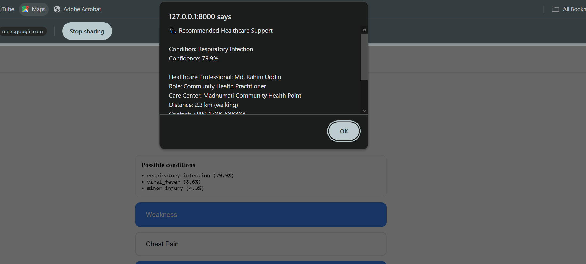

# Healthcare+

A symptom triage web app for people who live far from a doctor. You tap the part of your body that hurts, tap the symptoms you have, and a trained model returns the three most likely conditions with a confidence score for each. Almost no typing and almost no reading required.

Built for FutureBuilders 2025 by a team from NSU, KUET and BRAC under the INNOSTEM track.

**[Demo video](https://drive.google.com/file/d/1USsNGV7fo9vklaaEyoTWkcqudXk_4gis/view?usp=sharing)**



> **Not a medical device.** This returns preliminary guidance only. It is not a diagnosis and it does not replace seeing a doctor.

## The problem we were solving

In rural Bangladesh and the hill tracts, getting to a clinic can eat a whole day of work. Qualified doctors are thin on the ground, health literacy is low and mobile data is patchy. People end up guessing, waiting or paying for a trip they did not need.

That shaped three decisions:

- **Tap, do not type.** The whole flow is pictures and buttons. Someone who cannot read a symptom list can still point at a chest and tap a cough icon.
- **Keep it small.** Vanilla JS on the front, one Python process on the back, a model file measuring 3 KB. It runs on a cheap Android browser and a weak connection.
- **Give ranked answers, not one answer.** Three possibilities with confidence percentages tells a user how sure the system is. A single verdict would oversell it.

## How it works

```
index.html          sign in screen
   |
landingpage.html    tap a body part
   |
head.html / static/chestssym.html
   |                tap symptoms, hit Done
   v
POST /triage/head or /triage/chest
   |
predict_model.py    build the feature vector, run the model
   v
top 3 conditions with confidence
```

The front end sends a plain list of symptom strings. The backend maps those UI labels onto the model's feature names, builds a 14 slot binary vector in the exact order the model was trained on, then returns sorted probabilities. That feature order is saved to disk alongside the model in `feature_order.pkl`, which is what stops the vector from silently going out of order between training and serving.

**The model.** Bernoulli Naive Bayes from scikit-learn, trained on 14 binary symptom features across 6 conditions: migraine, viral fever, respiratory infection, gastro infection, cardiac risk and minor injury. Bernoulli was the right pick here because every input is a yes or no flag rather than a count or a measurement, and it stays readable and tiny, which matters when the whole point is running on low end devices.

## Endpoints

| Method | Route | What it does |
|---|---|---|
| GET | `/` | sign in page |
| GET | `/landingpage.html` | body part selection |
| GET | `/head.html`, `/chestssym.html` | symptom pages |
| POST | `/triage/head` | takes `{"symptoms": [...]}`, returns top 3 with confidence |
| POST | `/triage/chest` | same for chest symptoms |
| POST | `/chat` | text driven version of the same flow |
| GET | `/health` | server health check |

## Running it

```bash
git clone https://github.com/<your-username>/FutureBuilders2025_NSU_KUET_BRAC_INNOSTEM.git
cd FutureBuilders2025_NSU_KUET_BRAC_INNOSTEM

pip install fastapi uvicorn scikit-learn joblib numpy
uvicorn main:app --reload
```

Open `http://127.0.0.1:8000` in a browser.

## Stack

Python, FastAPI, Uvicorn, scikit-learn, joblib, numpy on the backend. HTML, CSS and vanilla JavaScript on the front, no framework.

## Where it stands

This is a hackathon prototype and the scope is honest about that:

- Head and chest are wired end to end. The other body parts on the landing page are built in the UI but not yet routed to the model.
- The `/chat` endpoint keeps its state in a single global dict, so it works for one user at a time. Real sessions need a token or a database.
- The training set is small and synthetic. Six conditions is a proof of the pipeline, not clinical coverage.
- Sign in is a front end screen only, there is no auth backend behind it.

## What comes next

- Wire the remaining body parts and grow the symptom to condition dataset
- Session tokens so more than one user can run the chat flow at once
- Offline first behaviour with sync, since the target users lose connection often
- Bangla language support
- Package it as an Android app
- Referral logic that points users to the nearest actual clinic instead of stopping at a prediction
